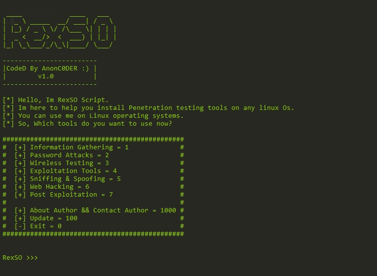

# RexSO
This tool helps you easily install penetration testing tools.
A toolbox that every hacker and hacking expert should have. With RexSO, you get rid of all the toolboxes.
This tool has been tested on ubuntu centos debian termux.
However, thank you in advance for notifying the bugs.

### Requirements :

- python v3
- pip install colorama

### Main Menu :

1. Information Gathering
2. Password Attacks
3. Wireless Testing
4. Exploitation Tools
5. Sniffing & Spoofing
6. Web Hacking
7. Post Exploitation
1000. About Author
100. Update
0. Exit  

### Information Gathering :
1. Nmap
2. WPScan
3. CMS Scanner
4. XSStrike

### Password Attacks :
1. Cupp
2. Ncrack
3. CeWL

### Wireless Testing :
1. Aircrack-ng
2. Wifite
3. Kismet

### Exploitation Tools :
1. Commix
2. ATSCAN
3. Sqlmap
4. Metasploit

### Sniffing :
1. Responder
2. Mitmproxy

### Web Hacking :
1. Nikto
2. Joomscan
3. Vbscan

### Post Exploitation :
1. Weeman

### Installation :
If git is installed, this command will work on all Linux operating systems :
git clone https://github.com/AnonC0DER/RexSO.git

### Donation : 
15v1b5gsjMKkvVLRWjCxb8pzFvXjyWQBQ8

### Screenshot : 

Contact me : 
AnonCODER@tutanota.com
telegram : @AnonC0DER
